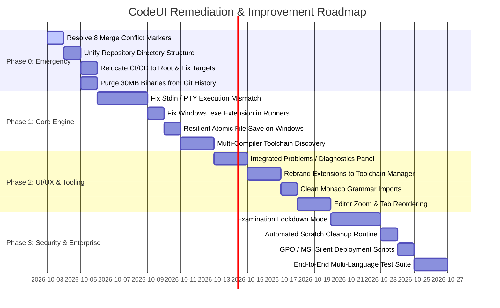

# CodeUI Strategic Roadmap Report 3: Necessary Improvements & Remediation Plan

**Audit Date:** October 2026  
**Target Repository:** `CodeUI` (`iamriteshhh/CodeUI`)  
**Scope:** Actionable engineering recommendations, architectural refactoring, UI/UX polish, stability hardening, and laboratory security enhancements.

---

## Executive Summary & Priority Matrix

To elevate CodeUI from its current state into a rock-solid, production-grade IDE for university examinations and laboratory environments, engineering efforts must be prioritized across four distinct phases:

| Priority | Phase | Core Objectives | Impact |
| :--- | :--- | :--- | :--- |
| **P0** | **Emergency Remediation** | Resolve merge conflicts, unify duplicated repository trees, fix broken CI discovery, purge committed binary blobs. | Restores project buildability and repository hygiene. |
| **P1** | **Core Architecture Fixes** | Re-architect the program execution and stdin/stdout pipeline, fix Windows executable naming, resolve file-locking race conditions. | Makes program execution and student interactive input (`scanf`, `cin`) work. |
| **P2** | **UI/UX & Tooling Polish** | Add a dedicated bottom Problems panel, re-scope the Extensions tab into an honest Toolchain Manager, fix Monaco imports. | Eliminates user confusion, boosts ergonomics and student productivity. |
| **P3** | **Lab Security & Deployment** | Implement Exam Lockdown Mode, automatic scratch disk pruning, and enterprise GPO/MSI silent deployment scripts. | Fulfills academic integrity requirements for high-stakes examinations. |

---

## 1. Phase 0: Immediate Emergency Blockers (P0)

### 1.1 Resolve Committed Git Merge Conflict Markers
Remove all raw conflict markers (`<<<<<<< HEAD`, `=======`, `>>>>>>>`) across the 8 affected files:
1. **`src-tauri/src/commands/env_detect.rs`:** Accept the `crate::proc::resolve_tool(spec.candidates)` branch to ensure tool discovery searches augmented system paths.
2. **`src-tauri/src/pty/mod.rs`:** Retain the `test_duplicate_session_id_is_rejected` unit test and remove conflict markers.
3. **`src/services/settingsService.ts`:** Accept `recentFolders: []` default and permanently delete hardcoded author paths (`D:\JAVA`, `C:\Users\sahil\...`).
4. **`src/services/editorService.ts`:** Retain both the model marker methods (`setMarkers`, `clearMarkers`) and the editor helper methods (`getText`, `focusActive`, `layout`).
5. **`src/languages/registerAllLanguages.ts`:** Retain registration tracking and error reporting arrays.
6. **`src/components/welcome/WelcomeView.tsx`:** Accept the empty recents list handling (`recentFolders || []`) with the graceful "No recent folders" empty-state UI.
7. **`src/components/editor/monacoSafeDefaults.ts`:** Accept the `CodeUI Mono` font family and disabled hover configuration.
8. **`package-lock.json`:** Re-run `npm install --package-lock-only` to cleanly regenerate the dependency tree without conflict markers.

### 1.2 Unify the Duplicated Repository Layout
Eliminate the confusing split between `d:\CodeUI\` and `d:\CodeUI\CodeUI-main\`:
- Promote all files from `CodeUI-main/` directly into the repository root `d:\CodeUI\`.
- Remove the stale, partial copies of `src/`, `src-tauri/`, `installer/`, and `installers/` currently at the root.
- Verify that running `npm install`, `npm test`, and `cargo test --workspace` at the root passes with zero configuration flags.

### 1.3 Relocate CI/CD Workflows to Repository Root
- Move `.github/workflows/ci.yml` and `.github/workflows/release.yml` to `d:\CodeUI\.github\workflows\`.
- Update workflow paths so GitHub Actions runners execute checks directly in the root workspace.

### 1.4 Purge 30+ MB of Compiled Binaries from Git History
- Remove the `installer/` and `installers/` directories containing `.exe`, `.msi`, `.deb`, and `.dmg` files from Git tracking:
  ```bash
  git rm -r --cached installer/ installers/
  ```
- Add `*.exe`, `*.msi`, `*.dmg`, `*.deb`, `*.AppImage` to `.gitignore`.
- Use GitHub Actions (`release.yml`) to automatically compile and attach native installers to official GitHub Releases rather than polluting repository clone bandwidth.

---

## 2. Phase 1: Core Architectural & Execution Engine Overhaul (P1)

### 2.1 Re-Architect Program Execution & Stdin Routing
**The Problem:** The current runner invokes binaries via Rust background processes while output and input are erroneously forwarded through the PTY shell, causing double-echo, command injection into PowerShell, and hung input (`scanf`/`cin`).

**The Solution:**
Choose one of two robust architectural models:

#### Architectural Model A: Native PTY Command Execution (Recommended for Lab IDEs)
Instead of running a separate invisible background process and trying to bridge output back and forth:
1. Keep the user's interactive PTY session as the primary execution environment.
2. When the student clicks **Run**:
   - Generate the clean compile command targeting the scratch directory.
   - Type the compile-and-run sequence into the PTY:
     ```powershell
     # Windows:
     gcc -Wall -g -o "$env:TEMP\codeui_scratch\program.exe" "main.c"; if ($?) { & "$env:TEMP\codeui_scratch\program.exe" }
     ```
     ```bash
     # Linux / macOS:
     gcc -Wall -g -o /tmp/codeui_scratch/program main.c && /tmp/codeui_scratch/program
     ```
3. **Benefits:**
   - 100% native terminal support for interactive keyboard input (`scanf`, `cin`, `input()`, `Scanner`), ANSI escape codes, terminal resizing, colors, and Ctrl+C cancellation.
   - Eliminates custom IPC streaming bottlenecks, batch timers, and duplicate process wrappers.

#### Architectural Model B: Dual-Mode Interactive Run Console
If maintaining the sandboxed Rust watchdog with timeout enforcement is desired:
1. In `TerminalPanel.tsx`, maintain an active execution state flag (`isRunActive`).
2. When a program is running:
   - Route `term.onData(input => processService.writeRunStdin(runId, input))`.
   - Route `processService.onRunOutput(chunk => term.write(chunk.chunk))`.
   - **Do not** write anything to `ptyService.writePty` during an active run.
3. When the process exits, return keyboard control back to the shell PTY.

### 2.2 Fix Windows Executable Suffix in C/C++ Runners
Update `runners/c.rs` and `runners/cpp.rs` to append the platform executable suffix:
```rust
let bin = ctx.scratch.join(format!("{}{}", ctx.stem(), std::env::consts::EXE_SUFFIX));
```
This guarantees that `CreateProcessW` on Windows resolves the generated `.exe` file without errors.

### 2.3 Resilient Atomic File Saving on Windows
Update `src-tauri/src/commands/fs.rs` `write_file`:
- Replace fragile `std::fs::rename` with a retry loop or explicit overwrite:
  ```rust
  #[cfg(windows)]
  {
      // If destination exists, replace with MOVEFILE_REPLACE_EXISTING or copy fallback
      if p.exists() {
          let _ = std::fs::copy(&tmp, &p);
          let _ = std::fs::remove_file(&tmp);
          return Ok(());
      }
  }
  ```
- Catches antivirus scanner locks and temporary file-indexing delays common in college laboratory environments.

### 2.4 Multi-Compiler Toolchain Auto-Discovery
Expand `runners/` and `commands/env_detect.rs` to detect alternative compilers:
- **C:** Probe `gcc`, `clang`, and `cl.exe`.
- **C++:** Probe `g++`, `clang++`, and `cl.exe`.
- **Python:** Continue probing `python`, `py`, and `python3`.
- Provide meaningful install hints if no compiler is found (e.g. `winget install LLVM.LLVM` or `winget install MSYS2.MSYS2` on Windows; `sudo apt install build-essential` on Ubuntu).

---

## 3. Phase 2: UI/UX & Tooling Enhancements (P2)

### 3.1 Integrated "Problems" Panel for Compiler Diagnostics
- While `parseCompilerDiagnostics` exists in `diagnostics.ts`, errors only appear as Monaco squiggles if compilation fails.
- Add a dedicated **Problems** tab in the bottom panel (alongside Terminal and Preview).
- Render errors and warnings in a structured list:
  ```
  [Icon] Error: 'x' undeclared (first use in this function)   main.c:14:5
  [Icon] Warning: unused variable 'count' [-Wunused-variable] main.c:8:9
  ```
- Clicking any error immediately jumps the editor cursor to that exact line and column.

### 3.2 Honest Toolchain Manager (Replacing the Extension Mock)
- Replace the misleading VS Code Open VSX marketplace search with a specialized **"Compilers & Languages"** panel.
- Clearly present the status of built-in toolchains:
  - C/C++ (GCC / Clang)
  - Java (JDK / javac)
  - Python (Python 3.x)
  - Salivo (`sf` compiler driver)
  - Web (HTML/CSS/JS sandbox)
- Provide one-click environment path verification, compiler version displays, and clear configuration buttons without pretend "Install" buttons for external VS Code extensions.

### 3.3 Replace Fragile Deep Node Modules Imports
In `src/languages/registerAllLanguages.ts`:
- Replace:
  ```typescript
  import * as cppLang from "../../node_modules/monaco-editor/esm/vs/languages/definitions/cpp/cpp.js";
  ```
- With proper package entry imports or standalone Monarch syntax definitions bundled in `src/languages/grammars/`. This guarantees compatibility with modern bundlers and prevents packaging breakage.

### 3.4 Editor Usability & Navigation Refinements
- **Tab Reordering:** Support drag-and-drop tab reordering.
- **Horizontal & Vertical Split:** Allow splitting editors both vertically and horizontally.
- **Zoom & Font Scaling:** Bind standard `Ctrl + =` / `Ctrl + -` hotkeys to scale editor font size dynamically.
- **Go to Line Modal (`Ctrl + G`):** Add a quick input modal to jump to a specific line number.

---

## 4. Phase 3: Lab Safety, Examination Security & Deployment (P3)

### 4.1 Examination Lockdown Mode
For computer labs conducting official tests, implement an optional `--exam` command-line flag or administrative toggle:
- **Lock Window:** Disables window minimizing or sets full-screen kiosk mode.
- **Disable Developer Tools:** Disables Inspect Element, Webview DevTools, and F12 hotkeys.
- **Workspace Confinement:** Prevents opening files outside the designated student exam directory.
- **Watermark Banner:** Displays student name, roll number, and exam timer prominently across the top title bar.

### 4.2 Automated Scratch Disk Pruning
- Student builds in `temp/codeui_scratch` accumulate over weeks on shared lab machines.
- Add a startup cleanup routine in `src-tauri/src/main.rs` that purges scratch build directories older than 24 hours.

### 4.3 Enterprise Lab Deployment Packaging
- Provide unattended installation parameters in the documentation:
  - **Windows MSI:** `msiexec /i CodeUI_0.1.0_x64.msi /qn /norestart ALLUSERS=1`
  - **Linux DEB:** `sudo apt install ./CodeUI_0.1.0_amd64.deb`
- Provide pre-configured default settings templates (`settings.json`) that lab administrators can deploy via Active Directory Group Policy (GPO) or Ansible.

### 4.4 Automated End-to-End Test Suite
Add end-to-end integration tests that compile and run real student programs in headless mode:
- C: Hello World & interactive addition program.
- C++: Vector iteration & string manipulation.
- Java: Packaged class detection & console printing.
- Python: Math calculations & list operations.
- Salivo: Stream header imports (`><`) & RAII `Drop` execution.

---

## 5. Implementation Roadmap Summary


