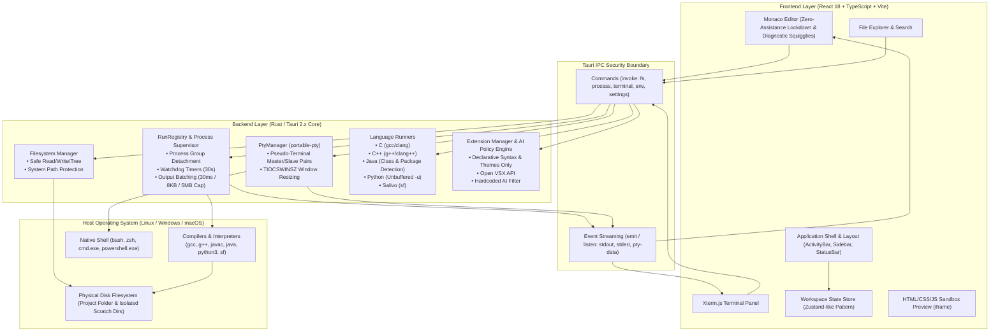

# PROJECT SYNOPSIS REPORT

---

# **CodeUI: A Lab-Safe Desktop Integrated Development Environment for Academic Computer Laboratories**

---

### **Project Metadata**
- **Project Title:** CodeUI (A Lightweight, Lab-Safe Academic IDE)
- **Academic Domain:** Software Engineering, Systems Programming, Developer Tooling & Human-Computer Interaction (HCI)
- **Target Audience:** Undergraduate / Polytechnic Computer Science & Engineering Departments, Laboratory Instructors, Evaluators, and Students
- **Core Architecture:** Tauri 2.x (Rust Backend) + React 18 / TypeScript / Monaco Editor (Frontend UI)
- **License:** Open Source (MIT License)
- **Primary Target OS:** Linux (Ubuntu 20.04/22.04/24.04 LTS), Windows (10/11 64-bit), macOS (Intel & Apple Silicon)
- **Repository:** `iamriteshhh/CodeUI`

---

## 1. Executive Summary & Abstract

In contemporary university and college computing curricula, laboratory practical examinations are conducted to evaluate a student's fundamental problem-solving and algorithmic programming skills. To maintain strict academic integrity, academic institutions routinely prohibit modern commercial Integrated Development Environments (such as Visual Studio Code, JetBrains CLion/IntelliJ, or Visual Studio) because they integrate automated code completion, IntelliSense, snippet expansions, and AI assistants (e.g., GitHub Copilot, ChatGPT, Tabnine). 

Consequently, institutions force students to write timed exam code in bare-bones text editors such as **Notepad, gedit, or nano**. While this measure prevents cheating, it inflicts a disproportionate operational penalty: students lose syntax highlighting, integrated terminal access, directory tree management, and structured compiler error diagnostics. Timed exams become exercises in managing operating system windows and debugging cryptic terminal outputs rather than demonstrations of algorithmic knowledge.

**CodeUI** is engineered to resolve this institutional dilemma. It is a desktop Integrated Development Environment that bridges the gap between bare-bones text editors and commercial IDEs. CodeUI provides a modern, ergonomic editing workspace—including syntax highlighting, project explorer, multi-tab editing, split views, an integrated pseudo-terminal (PTY), and one-click compilation—while **strictly, permanently eliminating all autocomplete, predictive suggestions, parameter hints, and AI coding assistance**. Furthermore, CodeUI integrates deep operating-system-level process isolation, watchdog timers, and memory-safe IPC to protect shared laboratory workstations against runaway loops, orphaned processes, and memory exhaustion.

---

## 2. Problem Statement & Motivation

### 2.1 The Laboratory Dilemma
During practical programming examinations in subjects such as *Data Structures & Algorithms*, *Object-Oriented Programming (C++/Java)*, and *Systems Programming*, the examination goal is to test whether a student can formulate algorithms and write syntactically correct code **from memory**. 

| Environment Option | Strengths | Severe Failures in Academic Labs |
| :--- | :--- | :--- |
| **Option A: Commercial IDEs**<br>*(VS Code, CLion, Eclipse)* | High developer productivity, integrated terminals, debugging tools. | **Compromises Exam Integrity:** Built-in autocomplete, automatic parameter hints, syntax completion, and AI plugins suggest code structure, making independent assessment impossible. High RAM footprint freezes older lab computers. |
| **Option B: Bare Editors**<br>*(Notepad, gedit, nano)* | Zero code generation or cheating assistance. | **Cripples Student Experience:** No integrated terminal (requires constant Alt-Tabbing to a shell), no directory view, poor/no syntax coloring, and no visual compiler error diagnostics. |
| **Proposed: CodeUI** | Complete editor ergonomics (tabs, split view, terminal, file tree, diagnostic markers). | **Lab-Safe & Zero-Assistance:** Guaranteed zero autocomplete, zero suggestions, process-group sandboxing, watchdog timeouts, and strict AI extension blocking. |

### 2.2 Operational Vulnerabilities on Shared Lab Machines
College computers are shared among hundreds of students across multiple batches each day. When students execute buggy code:
1. **Orphaned Background Processes:** Infinite loops or forked child processes continue running in the background even after the student closes the terminal window, causing system degradation.
2. **Buffer Flooding & Terminal Freezes:** Unbounded output loops (e.g., `while(1) printf("%d", i++);`) flood standard output, locking up the user interface or crashing the browser/webview.
3. **Workspace Litter:** Compilers (`gcc`, `javac`, `sf`) generate binary artifacts (`.exe`, `.class`, `.out`, `build/`) directly inside student assignment folders, leading to confusion during submission grading.

CodeUI addresses both the pedagogical need for **zero-assistance assessment** and the operational need for **workstation stability and cleanup**.

---

## 3. Project Objectives

1. **Pedagogical Integrity (Zero-Assistance Principle):**
   - Completely neutralize all autocomplete engines, word-based suggestions, parameter hints, automatic bracket/quote completion, and code-action lightbulbs across all supported languages.
   - Block keyboard triggers (`Ctrl+Space`, `Alt+Enter`, `F12`, `F2`) at both configuration and runtime dispatch levels.
   - Enforce an irreversible AI-blocking policy in both the UI catalog and the backend extension loader.

2. **Self-Contained Ergonomic Workspace:**
   - Provide a responsive multi-tab code editor with split-screen capability based on Microsoft's Monaco Editor engine.
   - Provide a full-featured integrated terminal using real pseudo-terminal (PTY) emulation (`xterm.js` + `portable-pty`), enabling interactive programs (`scanf`, `cin`, Python `input()`, curses, vim) without external windows.
   - Provide a real-time HTML/CSS/JavaScript web preview sandbox for web development labs.

3. **Lab-Safe Execution & Process Supervision:**
   - Execute student programs inside dedicated, detached process groups (`setsid` on Unix, `CREATE_NEW_PROCESS_GROUP` on Windows) so that the entire process tree can be terminated atomically.
   - Enforce configurable watchdog execution limits (default 30 seconds) to terminate hung programs automatically.
   - Implement escalating process termination: polite `SIGTERM` followed by forceful `SIGKILL` (or Win32 `taskkill /PID /T /F`).
   - Implement batched output buffering (30ms intervals, 8KB chunks) and a strict 5MB output ceiling to protect the UI thread from stream saturation.
   - Compile code into isolated, transient scratch directories so student project folders remain clean.

4. **Automated Toolchain Detection & Friendly Diagnostics:**
   - Scan the host environment `$PATH` on startup for installed compilers (`gcc`, `g++`, `javac`, `java`, `python3`, `sf`, `rustc`, `node`).
   - Parse compiler error streams into structured diagnostics that render inline Monaco squiggly underlines on exact offending lines and columns.
   - Translate low-level POSIX/Win32 exit codes (e.g., 139 $\rightarrow$ Segmentation Fault; 136 $\rightarrow$ Division by Zero) into human-readable explanations.

---

## 4. System Architecture

CodeUI is designed with a strict boundary separating the **Frontend Presentation Layer** from the **Native Systems Core**, bridged through asynchronous Tauri Inter-Process Communication (IPC).



### 4.1 Frontend Presentation Layer
- **Framework:** React 18 with TypeScript, bundled via Vite for sub-second hot reloading and optimized production tree-shaking.
- **Monaco Editor Wrapper:** Microsoft's Monaco Editor engine running under strict security constraints. All language providers (completions, suggestions, hovers, code-actions) are intercepted and unregistered.
- **Terminal Emulator:** `xterm.js` with the `@xterm/addon-fit` extension, rendering hardware-accelerated terminal output with ANSI/VT100 escape sequence support.
- **Component Hierarchy:** Modular architecture with dedicated shell components (`TitleBar`, `ActivityBar`, `Sidebar`, `StatusBar`, `Toasts`), editor panels (`MonacoEditorGroup`, `SplitEditorContainer`, `TabStrip`, `RunDebugBar`), explorer tools (`FileTree`, `SearchPanel`, `RunPanel`), extension catalog (`ExtensionsPanel`, `ExtensionDetailView`), and configuration modals.

### 4.2 Tauri IPC Bridge
- The frontend never executes operating system calls or accesses the filesystem directly.
- All operations pass through strongly typed Rust commands decorated with `#[tauri::command]`.
- Asynchronous streaming operations (such as terminal character streams or compiler output batches) are pushed via Tauri's high-performance event bus (`app_handle.emit()`) rather than polling.

### 4.3 Native Rust Backend
- **Memory Safety & Zero-Cost Abstractions:** Rust guarantees memory safety and thread safety without garbage collection overhead, vital for resource-constrained laboratory computers.
- **Process Supervisor (`src-tauri/src/proc` & `commands/process.rs`):** Spawns child processes with isolated process credentials, monitors CPU wall-clock duration with background watchdog threads, and handles interactive stdin pipes.
- **PTY Manager (`src-tauri/src/pty`):** Interfaces with operating system pseudo-terminal APIs (ConPTY on Windows, `/dev/pts` on Linux) through `portable-pty`.
- **Language Runners (`src-tauri/src/runners`):** Implements the `LanguageRunner` trait for each language, handling compilation arguments, output binary naming, and class/package detection.

---

## 5. Key Features & Innovations

### 5.1 The Zero-Assistance Lockdown Engine
Unlike general-purpose editors where disabling autocomplete is a user preference that can be reversed in a settings menu, CodeUI enforces zero-assistance at three architectural layers:
1. **Monaco Editor Configuration Options:** Disables `quickSuggestions`, `suggestOnTriggerCharacters`, `wordBasedSuggestions`, `parameterHints`, `inlineSuggest`, `snippetSuggestions`, and auto-closing quotes/brackets.
2. **Language Service Provider Interception:** The `applyZeroSuggestionsLockdown()` function intercepts Monaco's internal language registry, substituting `registerCompletionItemProvider`, `registerHoverProvider`, `registerDefinitionProvider`, and `registerCodeActionProvider` with dummy no-op disposables.
3. **Keyboard Command Overrides:** Intercepts standard completion keybindings (`Ctrl+Space`, `Ctrl+Shift+Space`, `Alt+Enter`, `F12`, `F2`) on editor mount and binds them to empty routines.

### 5.2 Lab-Safe Execution & Process Sandbox
Student programming assignments frequently produce runtime anomalies. CodeUI incorporates defensive execution guards:
- **Detached Process Groups:** On Linux, `libc::setsid()` isolates child execution. On Windows, `CREATE_NEW_PROCESS_GROUP | CREATE_NO_WINDOW` flags are injected into process creation.
- **Escalating Termination (`kill_tree`):** When a run terminates or times out, CodeUI dispatches `SIGTERM` to the process group, grants a 500ms grace period for output flush, and escalates to unconditional `SIGKILL` (or `taskkill /PID <pid> /T /F` on Windows) if the process remains active.
- **Window Close Enforcement:** Hooked to `tauri::WindowEvent::CloseRequested`, CodeUI immediately invokes `shutdown_all()` across `RunRegistry` and `PtyManager`, ensuring no runaway processes linger on shared computers when a student exits the app.
- **Output Throttling & Protection:** A dual-cadence pump buffers output characters, flushing only every 30 milliseconds or 8,192 bytes. Output is capped at 5 Megabytes per run, preventing infinite print loops from crashing the webview.
- **Scratch Directory Isolation:** Student code is compiled within a temporary directory (e.g., `/tmp/codeui-run-xyz` or `%TEMP%\codeui-run-xyz`), preventing intermediate object files and compiled binaries from cluttering the student's project workspace.

### 5.3 Intelligent Compiler Diagnostic Highlighting
When compilation fails, CodeUI does not merely dump raw terminal text. Its pure TypeScript diagnostic engine parses the output stream in real time:
- **C/C++ (`gcc`/`g++`/`clang`):** Extracts regex matching `file:line:col: error: message` and paints inline Monaco markers (red squiggly lines) on the exact source line.
- **Java (`javac`):** Identifies line numbers and scans subsequent lines for caret (`^`) column indicators.
- **Python (`python3`):** Scans multi-line traceback frames for file references and runtime error messages (e.g., `IndexError`, `NameError`).
- **Crash Hints:** Converts operating system signals into plain-language diagnostic hints:
  - Exit Code 139: *"Program crashed — likely a segmentation fault (invalid memory access)."*
  - Exit Code 136: *"Arithmetic error — likely a division by zero."*
  - Exit Code 137: *"Program was stopped — it ran too long or was killed."*

### 5.4 Advanced Java Class & Package Resolution
Java execution in academic environments is notoriously error-prone due to Java's file naming constraints. CodeUI's `JavaRunner`:
- Parses Java source text (ignoring comments and string literals) to find the declared class and determine whether it is `public`.
- Validates the class name against the source filename *before compilation*. If mismatched, it alerts the student with actionable advice: *"public class `Calculator` must live in a file named `Calculator.java`, but this file is `Main.java`."*
- Detects `package` declarations (e.g., `package com.college.lab;`) and automatically invokes `java -cp <scratch> com.college.lab.Calculator`, preventing `ClassNotFoundException` errors.

### 5.5 Fully Interactive PTY Terminal
Student programs requiring interactive input (such as `scanf("%d", &n);`, `cin >> x;`, or Python's `input("Enter your name: ")`) fail in editors that rely on standard redirected pipes because output buffers do not flush before input blocks. CodeUI embeds real PTY terminals:
- Uses `portable-pty` on Rust to allocate real PTY pairs (POSIX pseudo-terminals on Linux, Windows Pseudo Console / ConPTY on Windows).
- Runs Python with `-u` (unbuffered binary stdout/stderr) to guarantee prompts appear before input calls block.
- Terminal windows dynamically synchronize dimensions via `TIOCSWINSZ` ioctl calls, allowing full-screen command-line utilities (such as `nano` or `less`) to render accurately.

### 5.6 Declarative Extension Hub with Hardened AI Filtering
CodeUI supports community themes and syntax packages via the Open VSX registry, but enforces absolute lab policy:
- **Declarative Only:** Only syntax grammars (`.tmLanguage.json`), language configurations (comment markers, brackets), and UI themes are extracted. Executable JavaScript code, language server protocols (LSP), and code-action hooks inside VSIX archives are dropped.
- **Multi-Layer AI Policy Engine (`ai-policy.json`):** Evaluates extension package names, publishers, descriptions, and manifest contributions against a comprehensive blocklist (blocking terms such as `copilot`, `gpt`, `llm`, `claude`, `deepseek`, `assistant`, `inline-completion`). AI extensions are rejected at both the search/UI tier and the Rust VSIX unpacking tier.

---

## 6. Technology Stack & Technical Justification

```
┌─────────────────────────────────────────────────────────────────┐
│                      CODEUI TECHNOLOGY STACK                    │
├───────────────────────────────┬─────────────────────────────────┤
│ Component                     │ Selected Technology             │
├───────────────────────────────┼─────────────────────────────────┤
│ Frontend Framework            │ React 18.3 (TypeScript 5.7)     │
│ Bundler & Dev Tooling         │ Vite 6.1                        │
│ Code Editor Surface           │ Monaco Editor 0.56              │
│ Terminal Interface            │ xterm.js 5.5 + @xterm/addon-fit │
│ Desktop Application Framework │ Tauri 2.2                       │
│ Backend Systems Language      │ Rust (Edition 2021, Stable)     │
│ Process & PTY Subsystem       │ portable-pty 0.8, which 6.0     │
│ IPC Serialization             │ Serde & Serde JSON              │
│ Native Build Automation       │ Rust xtask crate                │
│ Unit Testing Frameworks       │ Vitest (Frontend), Cargo (Rust) │
└───────────────────────────────┴─────────────────────────────────┘
```

### 6.1 Why Tauri Instead of Electron?
1. **Resource Footprint:** Electron bundles a full instance of Chromium and Node.js with every application, resulting in a ~150MB to 200MB installer and high RAM consumption (~300MB idle). Tauri utilizes the operating system's native webview (WebKitGTK on Linux, Edge WebView2 on Windows) and a lightweight compiled Rust core. CodeUI's executable bundle is **~15MB**, and idle memory usage remains under **60MB-80MB**, making it smooth on aging 4GB-RAM lab workstations.
2. **Security & Auditable Boundaries:** Electron applications often grant the Node.js runtime full operating system access from the renderer process. Tauri enforces a strict, explicit command dispatch architecture: the frontend cannot execute arbitrary shell scripts or open raw file handles without calling an auditable Rust function.
3. **Native Low-Level Process Control:** Rust allows direct invocation of low-level POSIX system calls (`libc::setsid`, `libc::killpg`, `TIOCSWINSZ`) and Win32 APIs, providing dependable control over child process lifecycles.

### 6.2 The "No-Python-Tooling" Architectural Policy
CodeUI enforces an explicit rule: **Python is strictly an execution target for students; it is never used in the building, scripting, testing, or maintenance of CodeUI itself.** 
- Repository automation and version synchronization are implemented in a native Rust crate located in `xtask/`.
- This ensures that developers and CI runners do not need a secondary Python environment, eliminating script fragmentation and virtual environment dependencies.

---

## 7. Comparative Evaluation

| Feature / Metric | Bare Editors (Notepad / gedit) | Commercial IDEs (VS Code) | CodeUI (Proposed Solution) |
| :--- | :--- | :--- | :--- |
| **Exam Cheating Risk** | None | **Severe** (Copilot, IntelliSense, Snippets) | **Zero** (Strict Zero-Assistance Lockdown) |
| **Syntax Highlighting** | Minimal / None | Comprehensive | Rich, Color-Accurate Syntax Highlighting |
| **Integrated Terminal** | No (Alt-Tab Required) | Yes | Yes (Real PTY via xterm.js + portable-pty) |
| **Compiler Error Navigation** | Manual terminal reading | Inline squigglies + hints | Automatic Inline Squiggly Error Markers |
| **Process Group Isolation** | No (Orphans persist) | Variable | Strict (`setsid` / Win32 process groups) |
| **Watchdog Timeout** | None (Runs forever) | None by default | Hard Watchdog Timeout (Default: 30s) |
| **Output Memory Protection** | Terminal freezes | High memory consumption | Batched (30ms) & Capped at 5MB |
| **Scratch Build Sandboxing** | No (Lutters workspace) | Configurable | Automatic (Scratch dir per run) |
| **Memory Footprint** | Extremely low (<20MB) | Heavy (~300MB - 800MB) | Lightweight (~60MB - 80MB) |
| **Installer Size** | Pre-installed | Large (~120MB - 200MB) | Ultra-Compact (~15MB installer) |

---

## 8. Hardware & Software Requirements

### 8.1 Minimum Client Hardware Requirements (Target Lab PC)
- **Processor:** Dual-Core 64-bit x86_64 or ARM64 processor (1.8 GHz or faster)
- **Random Access Memory (RAM):** 2 GB minimum (4 GB recommended)
- **Storage Space:** 250 MB free disk space for CodeUI and cached dependencies
- **Display Resolution:** 1024 $\times$ 768 minimum resolution (1280 $\times$ 800 recommended)

### 8.2 Supported Host Operating Systems
- **Linux:** Ubuntu 20.04 LTS, 22.04 LTS, 24.04 LTS; Debian 11/12; Fedora 38+; Arch Linux (delivered as `.AppImage` and `.deb`)
- **Windows:** Microsoft Windows 10 (1809+) or Windows 11 (64-bit) with WebView2 Runtime (delivered as `.exe` setup and `.msi`)
- **macOS:** macOS 10.15 Catalina or newer (delivered as `.dmg`)

### 8.3 Student Runtime Dependencies (Host Compilers)
CodeUI automatically detects and utilizes standard toolchains pre-installed on laboratory workstations:
- **C/C++:** `gcc`, `g++`, `clang`, or MinGW-w64
- **Java:** OpenJDK or Oracle JDK (version 8, 11, 17, or 21+)
- **Python:** Python 3.8+ (`python3` or `python.exe`)
- **Salivo:** Salivo Compiler Toolchain (`sf`)
- **Web:** Any standard modern web browser engine (handled internally via webview)

---

## 9. Testing & Quality Assurance

CodeUI maintains a dual-tier testing matrix across both the Rust backend and the TypeScript frontend:

```
                          ┌─────────────────────────────┐
                          │   Continuous Integration    │
                          │      (GitHub Actions)       │
                          └──────────────┬──────────────┘
                                         │
                 ┌───────────────────────┴───────────────────────┐
                 ▼                                               ▼
    ┌───────────────────────────┐                 ┌───────────────────────────┐
    │     Rust Test Suite       │                 │   Frontend Test Suite     │
    │     (cargo test -w)       │                 │       (npm test)          │
    ├───────────────────────────┤                 ├───────────────────────────┤
    │ • Process Group Kill Test │                 │ • Zero-Assistance Specs   │
    │ • Exit Signal Translation │                 │ • Compiler Parser Tests   │
    │ • Tool Path Resolution    │                 │ • Path Normalization Test │
    │ • Java Class Detection    │                 │ • AI Policy Word Filter   │
    │ • UTF-8 Split Stream Test │                 │ • HTML Sanitization Tests │
    └───────────────────────────┘                 └───────────────────────────┘
```

1. **Rust Backend Test Suite (`cargo test --workspace`):**
   - *Process Termination:* Spawns sleep tasks and validates that `kill_tree` terminates both parent and child processes within the designated grace period without leaving orphans.
   - *Stream Decoding:* Verifies that `take_utf8` correctly buffers split multi-byte characters (e.g., Unicode symbols divided across read boundaries) without glyph mangling.
   - *Runner Compilation Verification:* Validates command structures for C, C++, Java, Python, and Salivo, ensuring scratch directory redirection works as specified.
2. **Frontend Vitest Suite (`npm test`):**
   - *Zero-Assistance Enforcement:* Verifies that `MONACO_LAB_SAFE_OPTIONS` contains disabled suggestion properties and asserts that keybinding interceptors nullify completion commands.
   - *Diagnostics Parsers:* Tests regex accuracy against real compiler outputs from GCC, Clang, Javac, and Python tracebacks under both Windows and Linux path conventions.
   - *AI Policy Evaluator:* Validates that `aiReason()` correctly detects blocked extensions, blocked publisher IDs, and keyword variations while permitting harmless language themes.

---

## 10. Future Scope & Roadmap

While CodeUI currently provides a complete, self-contained desktop IDE for college laboratories, several extensions are planned for future academic releases:
1. **Physical Lab Exam Mode (Kiosk Lockdown):** An optional instructor-activated kiosk mode that disables desktop switching (`Alt+Tab`, `Super` key) and restricts clipboard access to prevent copy-pasting from external cheat sheets.
2. **USB-Drive Portable Edition:** A zero-installation portable binary configured to run entirely from student USB flash drives on machines with restricted installation privileges.
3. **Plagiarism & Keystroke Rhythm Verification:** Non-intrusive local telemetry that logs typing velocity and burst cadence to assist examiners in identifying sudden block paste operations.
4. **Offline Local Documentation Browser:** An integrated, searchable offline documentation pane covering standard C library (`man 3`), C++ STL (`cppreference`), Python 3 standard library docs, and Java API documentation.

---

## 11. Conclusion

**CodeUI** successfully addresses an unresolved paradox in computer science education: the conflict between **modern software ergonomics** and **academic examination integrity**. By stripping away intrusive autocomplete, suggestions, and generative AI while preserving the core benefits of modern developer tooling—rich syntax highlighting, an integrated pseudo-terminal, a structured file tree, and intelligent compiler diagnostic markers—CodeUI establishes a trustworthy, student-friendly standard for college computing laboratories. 

Its memory-efficient, process-isolated Tauri/Rust architecture ensures that shared laboratory workstations remain fast, clean, and stable, allowing students to focus on what matters most: learning to think, solve problems, and write code independently.

---
*Report Prepared for Academic Project Evaluation, Laboratory Demonstrations, and Viva Voce Defense.*
